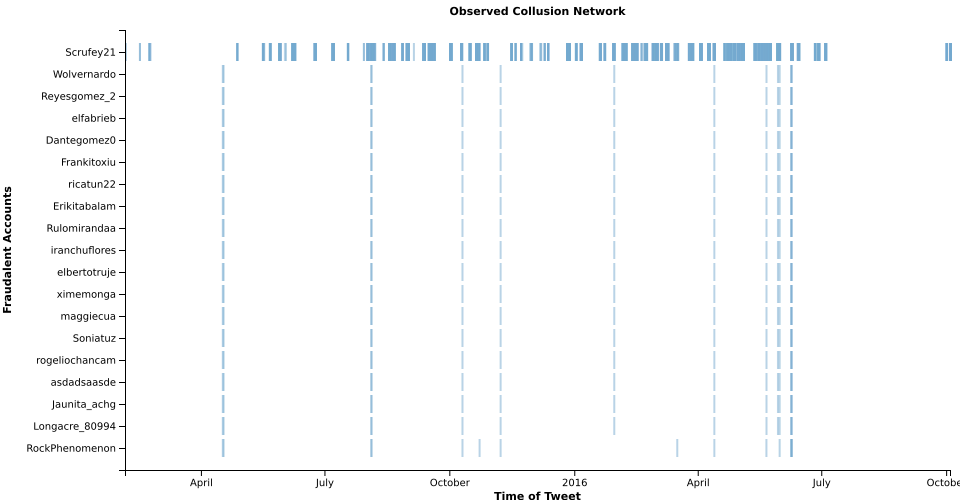

# **The Opinion Machine:** An Aggregated Analysis of Political Spam on Twitter

Read the paper [here!](documentation/paper.md)

## Background

This Git repo contains the work and final output for CS:4980 Topics in Computer Science, Networking & Security. The project prompt instructed us to implement techniques the class had read about during the course of the semester. Our professor [Zubair Shafiq](https://twitter.com/zubair_shafiq) graciously provided us with a year and a half of Twitter streams for Donald Trump and Hilary Clinton.

## Abstract

> Twitter has proven to be a chosen medium for hosting political discourse. During the 2016 U.S. election our study performed an analysis of 9.5 million tweets over nearly a year and a half, collect from previous capture of the twitter streams of Donald Trump and Hillary Clinton. We focused on identifying, classifying and analyzing automated involvement of the streams from both candidates. Our strategy exercised a multi-stage approach to funnel out automated accounts within the stream, of which we call the tweet rendering pipeline. The pipeline uses a hybrid approach and expands upon previous work to detect automated behavior. With our distilled rendering pipeline results, we applied a hashing technique to understand the content and possible actors participating in the automated involvement. Through this analysis we found a handful of automated accounts produced an asymmetric amount of tweets. Some of the tweets we found were duplicated over multiple accounts suggesting a collusion network, lining up previous work suggesting automated accounts are centrally controlled.

## Examples

## Thanks

To everyone who helped with the project. Notably Zubair for providing the data and continued guidance. And to my partner John, who without this wouldn't have been possible. 
