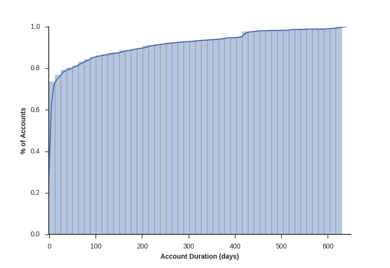
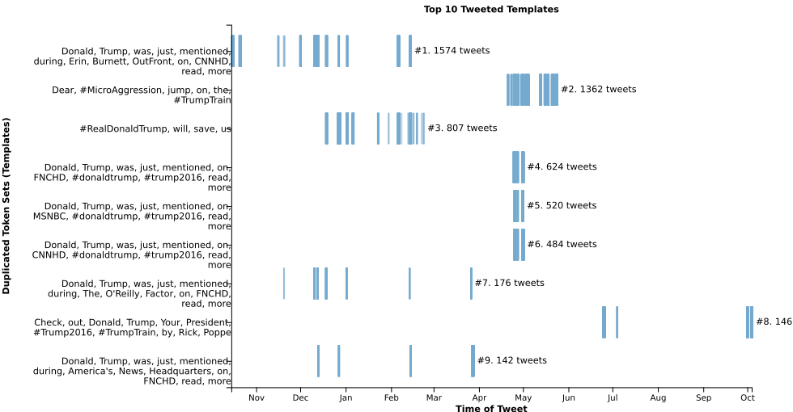

# _The Opinion Machine_: An Aggregated Analysis of Automated Political Spam on Twitter

[John Cook](mailto:john-cook@uiowa.edu), [Ryan Larson](mailto:ryan-p-larson@uiowa.edu). University of Iowa. Iowa City, IA.

**Keywords**: { Bots; Collusion Networks; Spam }

## Abstract

Twitter has proven to be a chosen medium for hosting political discourse. During the 2016 U.S. election our study performed an analysis of 9.5 million tweets over nearly a year and a half, collect from previous capture of the twitter streams of Donald Trump and Hillary Clinton. We focused on identifying, classifying and analyzing automated involvement of the streams from both candidates. Our strategy exercised a multi-stage approach to funnel out automated accounts within the stream, of which we call the tweet rendering pipeline. The pipeline uses a hybrid approach and expands upon previous work to detect automated behavior. With our distilled rendering pipeline results, we applied a hashing technique to understand the content and possible actors participating in the automated involvement. Through this analysis we found a handful of automated accounts produced an asymmetric amount of tweets. Some of the tweets we found were duplicated over multiple accounts suggesting a collusion network, lining up previous work suggesting automated accounts are centrally controlled.

## Introduction

Twitter users have placed more legitimacy on the content of their stream and social media is becoming a primary source to form political opinion[6]. During several election's throughout the world governments have participated in attempting to manipulate public perception through twitter. Several techniques to prevent or manipulate information have successfully affected stream information through hashtag colonization, trending topic influence, and account compromise[6]. Most notably is not the overt participation of government involvement, but also, just as equally effective, outside actors are practices the same methods to shape political discourse.. Automated accounts have been found to be highly effective to disseminate information to a wide audience[1]. In a recent study by Thomas et. Al, 5,000 compromised twitter accounts were found to be used to send over 550,000 tweets.

Traditionally spam has been used for monetary incentives, that is, user interaction and transactions produce a profit. However in the case of political messages the originator is seeking to 'sell' a message and many times needs to finance the automated dissemination of that message [6]. In a recent study it was found that government paid participants as much as $80,0000 for 22 trending topics to appear in their favor during elections in Mexico[6].

Bot's have also been used to censor or manipulate stream content in order to prevent a message from getting through [7]. Countries have employed preventative methods in order to control social media, however a more insidious approach to censorship is through hashtag colonization. Hashtag colonization has been employed by both Russia and China to prevent content from getting noticed. Given enough tweets containing the same hashtag, a message becomes lost in the sea of counterfeits . Therein lies the the purpose for which bots have been used to censor users. For instance if a user tweets with the hashtag, #thisMatters, an adversary wishing to manipulate the content of this message may use #thisMatters #saidNoOneEver. Thousands of bots tweeting hundreds of thousands of messages containing the adversary hashtags will quickly overtake and effectively colonize the original hashtag. More importantly, given enough automated hashtags, not only is the original hashtag muted, the adversary may promote their message through trending topics.

With such extreme measures employed to proliferate and manipulate user perceptions we place importance on identifying, classifying and analysing the content of bots in order to contribute toward detection research towards achieving germane conversations and perceptions free of bot clutter.

### Background

Political discussion is taking place on twitter and public opinions concerning political discourse are being influenced more rapidly than ever in history through online mediums like Twitter [6]. Online platforms have been known to draw non-authentic personas. As early as 1993 attempts to sway public discussion in online chatrooms through the use of fake accounts have been detected [5]. With increased availability to public APIs, such as that found on twitter, fake accounts, or bots, can be automated with little difficulty from a central location.

Whereas some bots are primarily used to spam, with monetary motivations in mind, political bots seek to sell a message. Central controllers have made use of political bots to attempt to manipulate and sway public opinion with motivations of favorable election outcomes in mind. Elections across the world have seen an increased involvement of political bots[5,6,7]. We seek to understand the involvement of political bots during the 2016 U.S. Presidential elections. To this end we conducted an analysis of over 9.5 Million tweets from 1.7 Million users, that were previously collected from the two streams of U.S. Presidential Candidates Donald Trump and Hillary Clinton. The collected tweets contained meta-data such as the screen name, the tweeted text, temporal data, followers and friends counts among other fields. In order to understand bot involvement in the two streams we established a tweet rendering pipeline with the motivation of understanding the bot's political message and gaining insight into the centrality of the bot network. The rendering pipeline allows an aggregated filtered approach to arrive at pool of automated users. We use previous account heuristics to measure account followers, friends, tweet rates, and account duration [1].

### Problem Statement

Automation is being employed to direct political conversation on twitter. Sometimes automated accounts are harmless, distributing legitimate information about a candidate, such as the time and location of rallies. In other cases there is evidence of sock-puppetry, with a high level of automated behavior and content. Recent work [Venezuela], [Russia], [Australia] demonstrate how much fake accounts spread misinformation and delegitimize political conversations on Twitter. Regardless of the avenue, automation influences the inception, course, and conclusion of the types of content people interact with on social networks.

### Proposed Approach

In order to gain an understanding of political bot activity, we expanded upon previous methods and available tools [1,3]. Our dataset consisted of a previous cache of collected tweets from the twitter streams of Donald Trump and Hillary Clinton. The collection contained over 9.5 million tweets from 1.7 million unique users ranging from Feb 3, 2015 - Oct 25, 2016\. To process such large data, a tweet rendering pipeline was established, utilizing high performance computing resources.

At a high level, the tweet rendering pipeline is a series of filtered aggregations performed in order to develop a pool of twitter accounts believed to be controlled by bots. Previous methods used twitter account statistics such as counts from the account follower and friend, tweet frequency and account duration as heuristics to identify twitter accounts that were used for spamming. Similar heuristics were used for selecting bots as candidate's within this dataset, identifying over 142,000 twitter accounts as bot candidates.

Using identified bot candidates as a starting point, usernames were applied as input to the bot-or-not api. This api was chosen to add an additional classification of whether an account exhibited bot-likeness. Bot-or-not uses twitter's REST api to query a twitter account and classify bot-likeness using algorithms formed from previously trained profiles [2]. Once a pool pool of bot accounts was form, all tweets from those bots were aggregated and analysed for content (what were these bots tweeting) and as well tweet duplication. Tweet duplication served as an identifier of account centrality, or simply put, accounts autonomously controlled by a single user.

### Key Results

We deconstruct our findings into three categories; the bot accounts, the content of their tweets, and the temporal synchronicity among bots. We sum meta-data among the identified bots, finding a small number of users who manage to publish thousands of tweets over months while remaining undetected. After our account level analysis we aggregate tweet content, and find politically slanted subject matter. We then tokenize each tweet to produce unique hashes and identify near duplicate statuses used to saturate our candidate's streams. Finally we examine the temporal relationship between spam accounts and token hashes, possibly identifying a Spam-as-a-Service collusion network.

## Related Works

This study sought to form a hybrid approach from previous work performed, in order to identify, classify and analyze bot-controlled accounts.

Twitter exercises suspension mechanisms to prohibit aggressive following techniques used simply to "get noticed"[site twitter' policy]. Earlier work that explored spam detection provided a correlation between aggressive following and spammy accounts [8]. Further work by Thomas et. al provided insight into twitter's spam detection algorithm by characterizing twitter accounts with heuristics to measure the sensitivity of spam suspension likelihood. Spam accounts that were suspended were found to show common attributes related to account duration, relationships, tweet rates, and total tweets of the account[1, 3].

Our work used a similar approach to define heuristics using meta-data in order identify automated accounts. Bessi et. al and Davis et. al classified twitter accounts bot-likeness using a publicly available api, _Bot Or Not_. The API provides a service to query twitter screen names and classify their account bot-likeness, through a machine-learning algorithm using previously trained profiles [3]. We classified candidates' bot-likeness through _Bot Or Not_'s structured score response.

## Proposed Approach

We aggregated over 9.5 million tweets to identify unique users. Following a set of identified users we build a bot candidate list, using heuristics from previous work [1,2, 3]. We used the _Bot Or Not_ API to identify account automation. Following bot classification we performed internal analysis to understand what bots were saying and how likely two or more bots were being control by the same entity. A more detailed explanation follows.

### Identification

In the first stage of the tweet rendering pipeline we began to filter the list of aggregated users in order to identify bot candidates. We used heuristics of account duration, relationship counts, and tweet rates, similar to those found in previous work [1]. Previous work showed that accounts controlled autonomously, primarily used for spamming on twitter, exhibited similar follower, friend and account duration statistics. We identified a bot candidate as an account that had been active for at most 31 days from since the date of their first tweet, had less than 15 followers or friends, or had at least 1,000 tweets in the account stream. Candidates were combined into a list containing attributes of userId, tweet count statistics, relationship counts (follower and friend) as well as temporal statistics.

### Classification

Stage two of the pipeline consists of classifying candidates. We chose to use an open source API from _Bot Or Not_. _Bot Or Not_ uses an ensemble of algorithms trained with simple and complex user profiles [3] The API classifies twitter accounts with a score of greater than .50 as more "bot-like" and less than .50 as more "human-like". _Bot Or Not_ also classifies twitter account streams with different categories of sentimental data. The API requires twitter authentication credentials. We created over 30 accounts divided over 10 simultaneous jobs. Our parallel jobs were reduced to 4 well into a mature point point of the API query, likely due to automated rules rules on our computing resources. With the reduction of simultaneous jobs our query was only able to produce roughly 5,000 identified accounts.

### Extraction

In stage three and four we retrieve the tweets associated with known classified bots, in order to understand the content and the centrality of bot accounts. We associated tweet text with userIds returned in the classification stage. We identified user accounts, controlled by the same entity (centrality) as accounts that exhibit duplicate tweets. In order to streamline search we tokenized tweets by stripping off any additional mentions, RT (other fields) in order to obtain the raw tweet. We then parsed each tweet into individual words, and formed a hash from the a tuple of tokens. We used python's hash function to create the has. We used these hashes to identify duplicate tweets.

### Analysis

To explore centrality we hypothesized that accounts controlled by the same user may be tweeted the same content as other accounts. We sought to identify this though scripts but performed more visual analysis upon generated charts. We hoped to examine both tweet duplication and similar temporal statistics in order order to support identifying centrally controlled accounts.

## Results

Our analysis seeks to uncover the most active automated accounts, what they were tweeting, and how automated accounts disseminated their tweets.

### Bot Accounts

We identify 142,000 bot candidates using previously defined heuristics. _Bot Or Not_ returned responses for over 5000 accounts, with an ensemble of classifications. Using the overall score and _Bot Or Not_'s threshold of 0.5 [0-1] to positively classify bots, we identified 995 bots. Using the positively classified userID's as a key, we gather all of the 'poisoned' tweets from the bots in our candidate streams. We identified the most prolific bots by summing the number of statuses each bot contributed. Two trends are apparent from the summation; a Pareto Effect in automated activity, and a polarization of content.

The top automated accounts are disproportionately responsible for the volume of tweets observed. We extracted 77,722 tweets from our candidate's streams by 995 bots. The vast majority of bots tweeted only a few times, with 840 bots tweeting less than 10 times overall. Our small, but vocal, 155 remaining accounts were responsible for 75,250 of all the extracted tweets. The most active user @jCar89000 tweeted 16,989 statuses, and was responsible for 22% of all of our known fraudulent statuses. Because of our incomplete API Classification we cannot say what portion of our total candidate stream was a result of automation.

### Bot Content

Having identified who were the egregious offenders, we then profile what the accounts were tweeting. We took a dual approach to understanding the qualitative and quantitative content attributes of the automated accounts.

To better understand the climate of the disseminated messages, we aggregate the hashtags, URLs, and user mentions. Twitter includes a field for the entities in it's API, which we use in our summation. Similar to previous work[4], we find that many of the most common hashtags contribute to a distinct narrative. Our findings indicate high amounts of polarization and negative sentiment among the top tweeted hashtags. #HilaryTapes, #TrumpTrain, and #microaggression for example are all in the top 10 hashtags.

**Most Tweeted Hashtags by Bots**

> 3701 unique hashtags.

> from 69876 bot tweets using hashtags

   | Hashtag          | Occurrence
-- | ---------------- | ----------
1  | trump2016        | 7867
2  | trump            | 5280
3  | clinton          | 5019
4  | thenewsclub      | 4883
5  | donaldtrump      | 3451
6  | redstate         | 2609
7  | boycottstarbucks | 2495
8  | trumptrain       | 2194
9  | hillarytapes     | 1839
10 | news             | 1400

Of the URL entities that still resolve, we find two common patterns, pre-shortened URLS and resolving to a mixture of legitimate news sites and extremely slanted opinion sites. As mentioned many of the URLs are pre-shortened prior to being tweeted.This provides a level of obfuscation and possibly information hiding. We suspect this may help conceal the source of the 'headline'. We find other URLs resolve to blog-like websites without the possibility of user interaction. We are unsure of the reasoning these sites are practicing obfuscation, however one-way communications seems to ensure message delivery without opposing interference.

**Most Tweeted URLs by Bots**

> 53652 unique URLs

> from 74736 bot tweeted links

   | Resolved URLs                  | Occurrence
-- | ------------------------------ | ----------
1  | <http://cnnpolitics.com>       | 2535
2  | <http://cnn.it/20ndgad>        | 2494
3  | <http://growapair.gq>          | 1362
4  | <http://bit.ly/1rcvg6d>        | 807
5  | <http://ift.tt/1jjvmta>        | 760
6  | <http://on.fb.me/1l1mvpu>      | 749
7  | <http://ift.tt/1h21yzd>        | 565
8  | <http://ift.tt/1kfdkrh>        | 432
9  | <http://www.apple.co/1h1p4do>  | 309
10 | <https://youtu.be/gw8c2cq-vpg> | 301

**Most Tweeted Domains by Bots**

> 2298 unique domains

> from 53652 URLs

   | Tweet Link Domain         | Occurrence
-- | ------------------------- | ----------
1  | ift.tt/                   | 8931
2  | api.youreon.media/        | 8336
3  | bit.ly/                   | 5155
4  | twitter.com/              | 5070
5  | tnc.news/                 | 2966
6  | dlvr.it/                  | 1478
7  | cnn.it/                   | 1235
8  | nyti.ms/                  | 1116
9  | www.whodoyoulike2016.com/ | 1112
10 | prt.news/                 | 963

Our investigations into user mentions did not prove to be fruitful. So far as we can surmise, the distribution of user mentions is typical in comparison to other work.

More importantly, we observed that small minority of users are effective at producing a large volume of tweets. This observation lead to another iteration of investigation.

### Tweet Repetition

After noting the effectiveness of a small amount of users contributing to such a large footprint, we aim to find patterns within bot activity. Raw tweet content is inappropriate to use while finding patterns, single character differences prevent comparisons. Fortunately this problem has been thoroughly covered by Natural Language Processing, and we adopt a port of [10] to cover ground.

To identify replication we create tokens from each tweet; removing user mentions, URL's, extraneous stop words (I, but, for), and punctuation. This left us with the salient portions of a tweet, such that duplicates of a tweet may be identified with the same hash.

 **Tweet converted to Token example:**

1. "Donald Trump was just mentioned on [CNN](www.cnn.com)" -> `[Donald', 'Trump', 'was', 'just', 'mentioned', 'on']`
2. If the link was to [Fox](www.fox.com), the tokens would still be the same: -> `[Donald', 'Trump', 'was', 'just', 'mentioned', 'on']`

Armed with a tweet's tokens and resulting hash, we quantify the repetition of bots by measuring the frequency of each hash. We find evidence of automation in the most tweeted hashes in the duplication of single token sets and near duplicates of multiple token sets. The most popular hash was tweeted 1,500 times by one user. However, near every other hash has a low appearance count, making the duplication more evident. We find small portion is responsible for the majority of the duplicated tweets leave a long tail of identified bots that go undetected but are not utilized.

Looking at the top hashes in aggregate allows us to draw comparisons between similar tokens, e.g. 69 of the top 100 hashes are near identical duplicates of each other. We classify token sets as templates of each other if they have at most 2 tokens difference occurring at the same index. Loosely, the template`s preset format contains placeholders which enable a finer grained message.

In particular one user, @dtrumptvfan, ranked as our 2nd most active user with 8,337 tweets. @dtrumptvfan's tweets typify the templates we describe, all of them have only a 1-2 token difference at the same index. The changed tokens are news sources, advertising Donald Trump's appearances on CNN, MSNBC, and FOX as well as niche conservative coverage. The account acts as an amplifier, multiplying whatever coverage that exists. This is a recurring theme of the most circulated activity.

### Time Synchronicity

Having identified who the most prolific bots are, we investigate the temporal aspect of the spam statuses. Thomas et Al. found 92\% of spam accounts suspended within three days of first activity, and the longest active duration account is no more than 178 days[1]. However we find accounts that exhibit automated characteristics are lasting well into 2 years of duration.

A portion of automated accounts have been established for years, many have been around for months. Only the popular tweet hashes lasted months, given that the most popular tweet hashes appear Templated tweets are the most common content from hashes lasting more than a month. The most tweeted hash persisted 121 days.

We find time synchronicity to be a valuable avenue of pursuit. Our analysis suggests token templates share first and last appearances with similar tokens, in varying durations. Still, a vast majority of bot statuses took place over hours, not days. The top 25 hashes had three such synchronized bursts, with multiple tweet permutations (templates) being pushed hundreds of times in a single day. Hashes #4-6 were tweeted 1,628 times over two weeks, with the same incidence of timestamps.

### Collusion Network

In our analysis we find evidence of a political collusion network. The network has two strong collusion indicators; temporal synchronicity (timestamps line up) and token similarity (they all say the same thing). Over 14 months a set of 18 users are observed to tweet in unison. Further, all 18 users are tweeting 'original' tweets (not retweeted) and their accompanying shortlinks that all resolve to the same host. We suspect traditional approaches of spam as a service may be employed[1,7]. We leave this discovery for future work.

## Discussion

Our hybrid approach created a repeatable test in order to identify, classify and analyse twitter bot account presence. Although our _Bot Or Not_ query did not yield the quantitative results we desired, we speak qualitatively. Firstly a small number of bot-like account were responsible for the majority of the tweets. This result falls in line with previous research[1] and provides room for future work to explore the possibility of new heuristics. More work needs to be done to understanding normal frequency and content of a charged environment. Secondly, we find that the timing of tweets may contribute to noticability. We find that among the duplicated tweets there appears to be an irregular and clustered pattern relative to their tweet time. We suspect that this burst release may possible point to learned event-response behaviors and leave this exploration to future work. Furthermore we find evidence of repeated duplicated original tweets spread across 18 account within no more than 10 hours apart per burst, supporting our original hypothesis that automated accounts are centrally controlled.

## Conclusion

The power to disseminate frequent messages to large audiences through social networks has made the ability to form public opinion from a central location. Such influences as trending topics, allow users to pay attention to what is popular. However, artificially inflated statistics give credence to messages that may not have been noticed or support such statistics had they not been amplified from an automated network. We found the filtered aggregated approach to be effective in that bot content analysis could prove to aid in future prevention of bot activity in such charge environments. We find that a very small minority contributed to a large amount of tweets. We conclude that the rudimentary problem is not bots but their influence upon content presentation and their ability to affect the outcome things like trending topics. We propose for future work to investigate bot prevention through bot colonization. We suspect the main purpose of the bots are to support influencing trending topics.

--------------------------------------------------------------------------------

## References

[1] K. Thomas, C. Grier, V. Paxson, D. Song. Suspended Accounts in Retrospect: An Analysis of Twitter Spam. IMC '11 Proceedings of the 2011 ACM SIGCOMM conference on Internet measurement conference Pages 243-258.

[2] E. Ferrara, O. Varol, C. Davis, F. Menczer, A. Flammini. The Rise of Social Bots. Communications of the ACM, Vol. 59 No. 7, Pages 96-104.

[3] A. Bessi, E. Ferrara. Social Bots distort the 2016 U.S. Presidential election online discussion. First Monday, Volume 21, Number 11 - 7 November 2016 <http://firstmonday.org/ojs/index.php/fm/article/view/7090/5653>. doi: <http://dx.doi.org/10.5210/fm.v21i11.7090>.

[4] B. Kollanyi, P.N. Howard, and S.C. Woolley, 2016\. "Bots and automation over Twitter during the first U.S. Presidential debate," COMPROP Data Memo 2016.1 (14 October), at <http://politicalbots.org/wp-content/uploads/2016/10/Data-Memo-First-Presidential-Debate.pdf>, accessed 1 November 2016.

[5] B. Waugh, M. Abdipanah, O. Hashemi, S. Abdul Rahman, D. Cook. The Influence and Deception of Twitter: the authenticity of the narrative and slacktivism in the Australian electoral process. Originally published in the Proceedings of the 14th Australian Information Warfare Conference, Edith Cowan University, Perth, Western Australia, 2nd-4th December, 2013.

[6] M. and H. Forelle, N. Philip , A. Monroy-Hernandez, S. Savage. Political Bots and the Manipulation of Public Opinion in Venezuela (July 25, 2015).

[7] K. Thomas, C. Grier, V. Paxson. Adapting Social Spam Infrastructure for Political Censorship. Proceedings of the USENIX Workshop on Large-scale Exploits and Emergent Threats (LEET), April 2012.

[8] Almuhimedi, Hazim et al. "Tweets are forever: a large-scale quantitative analysis of deleted tweets." CSCW (2013).

[9] Twitter Following Rules and Best Practices. <https://support.twitter.com/articles/68916>.

[10] K. Gimpel, N. Schneider, B. O'Connor, D. Das, D. Mills, J. Eisenstein, M. Heilman, D. Yogatama, J. Flanigan, and N. A. Smith. CMU ARK Twitter Part-of-Speech Tagger. In Proceedings of the Annual Meeting of the Association for Computational Linguistics, companion volume, Portland, OR, June 2011.

[11] Part-of-Speech Tagging for Twitter: Annotation, Features, and Experiments 
Kevin Gimpel, Nathan Schneider, Brendan O'Connor, Dipanjan Das, Daniel Mills, Jacob Eisenstein, Michael Heilman, Dani Yogatama, Jeffrey Flanigan, and Noah A. Smith 
In Proceedings of the Annual Meeting of the Association for Computational Linguistics, companion volume, Portland, OR, June 2011. 
<http://www.ark.cs.cmu.edu/TweetNLP/gimpel+etal.acl11.pdf>
